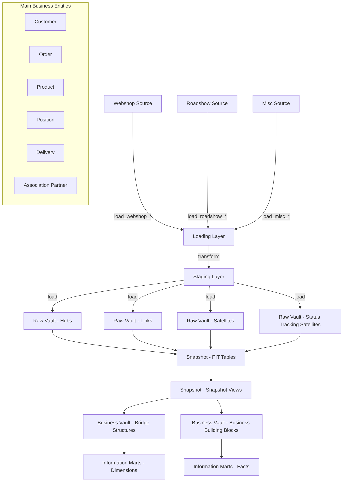
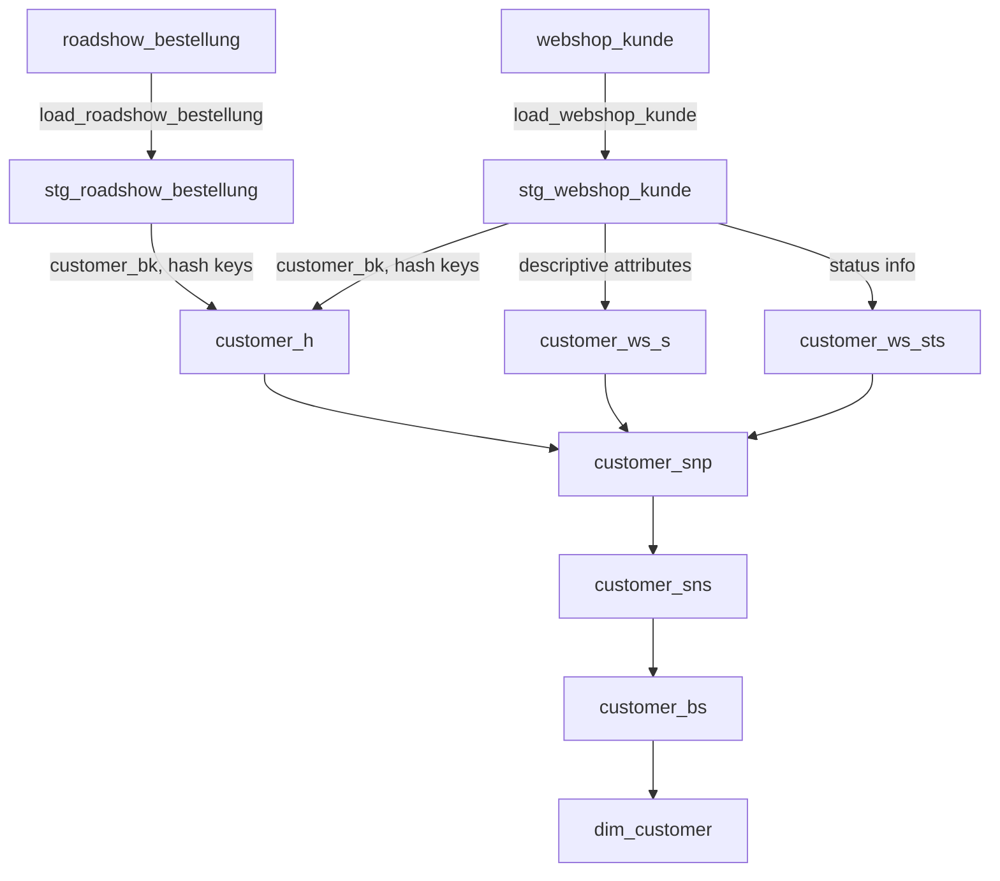
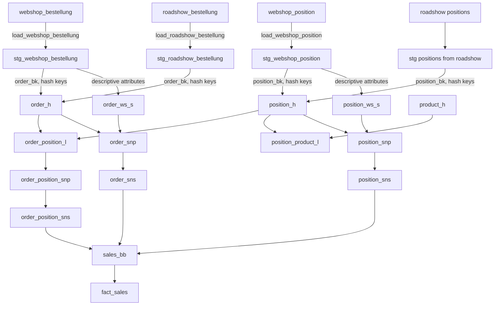

# Data Lineage Documentation for Willibald Data Vault with dbt

This document outlines the data flow through the Willibald Data Vault implementation, from source systems to final information marts.

## Overview of Data Architecture

The Willibald Data Vault implementation follows a layered approach with the following components:

1. **Source Systems**:
   - Webshop (`webshop_*`)
   - Roadshow (`roadshow_*`)
   - Miscellaneous (`misc_*`)

2. **Loading Layer** (`dwh_02_load`):
   - Extracts data from source systems
   - Performs minimal transformations for loading

3. **Staging Layer** (`dwh_03_stage`):
   - Standardizes and validates source data
   - Calculates hash keys for Data Vault entities
   - Prepares data for loading into the Raw Vault

4. **Raw Vault** (`dwh_04_rv`):
   - Contains Hubs, Links, and Satellites following Data Vault 2.0 methodology
   - Stores all historical data with load dates and source references

5. **Snapshot Layer** (`dwh_05_sn`):
   - Contains Point-in-Time (PIT) tables and Snapshot Views
   - Provides time-slice query capabilities for historical analysis

6. **Business Vault** (`dwh_06_bv`):
   - Contains business rules and transformations
   - Builds business-oriented structures based on Raw Vault data

7. **Information Marts** (`dwh_07_inmt`):
   - Dimensional models (facts and dimensions)
   - Provides business-friendly access for reporting and analytics

## Lineage Diagram

## Key Business Entities and Their Flow

### Customer Entity Flow

### Sales/Order Flow

## Source-to-Target Details

### Key Data Sources

1. **Webshop Sources:**
   - kunde (customer)
   - bestellung (order)
   - position (line item)
   - produkt (product)
   - lieferung (delivery)
   - lieferadresse (delivery address)
   - lieferdienst (delivery service)
   - vereinspartner (association partner)
   - produktkategorie (product category)
   - wohnort (residence)

2. **Roadshow Sources:**
   - bestellung (order with customer data)

3. **Miscellaneous Sources:**
   - kategorie_termintreue (delivery adherence category)

### Information Mart (Dimensional Model)

The final dimensional model consists of:

**Facts:**
- fact_sales (sales transactions)
- fact_error (error records)

**Dimensions:**
- dim_customer (customer information)
- dim_product (product information)
- dim_productcategory (product category hierarchy)
- dim_associationpartner (association partner information)
- dim_category_deliveryadherence (delivery performance categories)
- dim_product_type (product type reference data)
- Time dimensions:
  - dim_sales_date (order date)
  - dim_delivery_date (delivery date)
  - dim_requested_date (requested delivery date)
  - dim_reporting_date (reporting context date)

## Data Vault Pattern Implementation

This project implements the full Data Vault 2.0 methodology, including:

1. **Hubs** - Store business keys with their hash keys
   - Example: `customer_h` stores the unique customer business keys

2. **Links** - Store relationships between business entities
   - Example: `order_position_l` links orders to their line items

3. **Satellites** - Store descriptive attributes for Hubs and Links
   - Example: `customer_ws_s` stores customer attributes from the webshop

4. **Status Tracking Satellites (STS)** - Track entity status changes
   - Example: `customer_ws_sts` tracks customer status changes

5. **Point-in-Time (PIT) Tables** - Store dates/times for historical queries
   - Example: `customer_snp` contains load date pointers for all customer satellites

6. **Snapshot Views** - Simplify point-in-time queries across satellites
   - Example: `customer_sns` pre-joins hub and satellites as of each snapshot date

The project uses a multi-source approach with source-specific satellites (e.g., `_ws_` for webshop, `_rs_` for roadshow).
